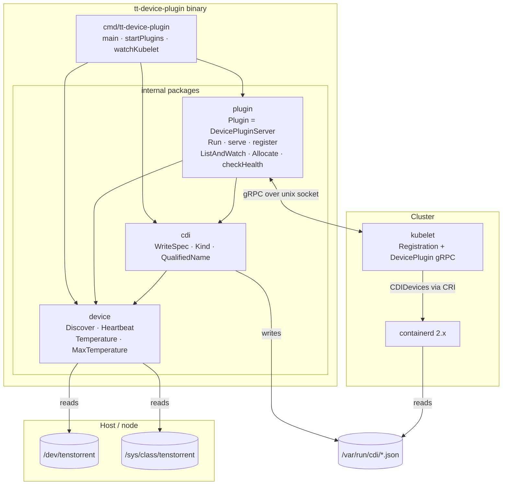
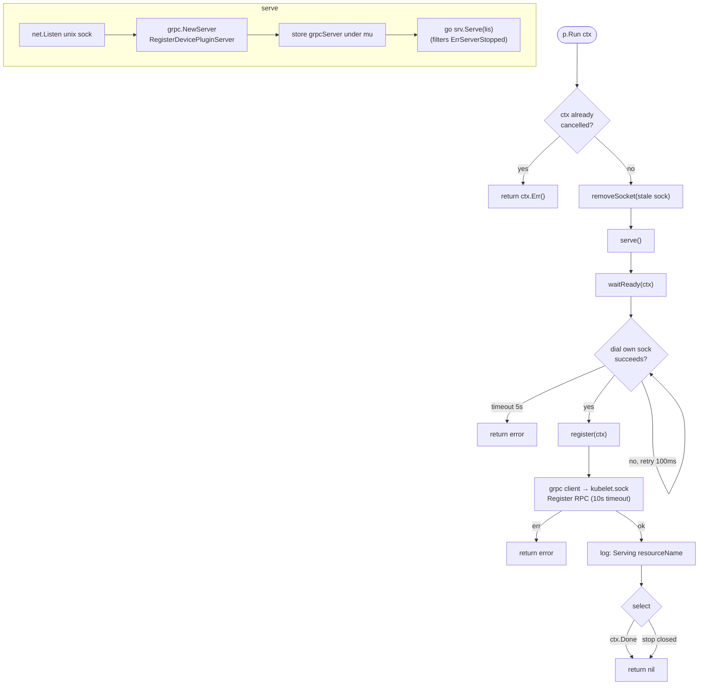
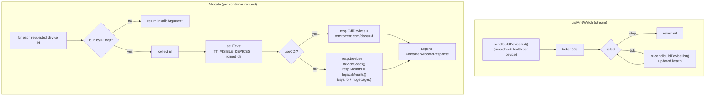
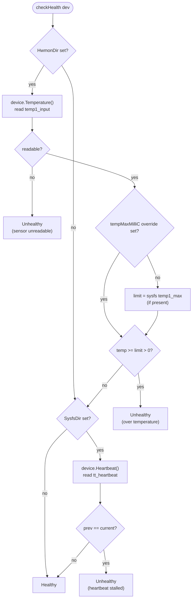
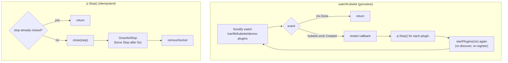

# Architecture & Control Flow

The plugin's component structure, then how control flows through it from process
start to container allocation. Diagrams are Mermaid (rendered natively by
GitHub). Mirrors the code in
[cmd/tt-device-plugin/main.go](cmd/tt-device-plugin/main.go),
[internal/plugin/plugin.go](internal/plugin/plugin.go),
[internal/device/discover.go](internal/device/discover.go), and
[internal/cdi/cdi.go](internal/cdi/cdi.go).

## Components

Package structure and dependencies. Arrows are "depends on / talks to".



**Responsibilities:**

| Component | Role |
|-----------|------|
| `cmd/tt-device-plugin` | Orchestration: discovery, per-class plugin startup, kubelet-restart watch, shutdown. Owns no device logic. |
| `internal/device` | The only package that touches the host: discovery + sysfs reads (card type, NUMA, hwmon, heartbeat, temperature). Leaf package. |
| `internal/cdi` | Generates CDI specs from `device.Device` data. Depends on `device`, not on `plugin`. |
| `internal/plugin` | The gRPC `DevicePluginServer`: lifecycle, registration, `ListAndWatch`, `Allocate` (CDI or legacy), health. Depends on `device` + `cdi`. |

Deployed as a DaemonSet via the Helm chart in [helm/tt-device-plugin](helm/tt-device-plugin);
`device`/`sys`/`cdi` host paths are mounted in (see [PREREQUISITES.md](PREREQUISITES.md)).

## 1. Process startup & lifecycle

```mermaid
flowchart TD
  START([main]) --> INIT["klog init<br/>signal.NotifyContext SIGINT/SIGTERM"]
  INIT --> SP["startPlugins(ctx)"]

  subgraph SPB["startPlugins"]
    DISC["device.Discover()<br/>scan /dev/tenstorrent + /sys"]
    DISC --> CHK{"devices found?"}
    CHK -->|no / err| FATAL["klog.Fatalf — exit"]
    CHK -->|yes| CDIQ{"TT_CDI_ENABLED?"}
    CDIQ -->|yes| WSPEC["cdi.WriteSpec per class<br/>→ /var/run/cdi"]
    CDIQ -->|no| LOOP
    WSPEC --> LOOP["for each resource class"]
    LOOP --> NEW["plugin.New(class, devs)"]
    NEW --> GORUN["go p.Run(ctx)"]
  end

  SP --> WATCH["go watchKubelet(ctx, restart)"]
  WATCH --> BLOCK["&lt;-ctx.Done()"]
  BLOCK --> SHUT["Shutting down:<br/>p.Stop() for each plugin"]
  SHUT --> END([exit])

  GORUN -.spawns.-> RUNREF["Run() — see section 2"]
  WATCH -.on kubelet.sock recreated.-> RSTREF["restart — see section 5"]
```

## 2. Per-plugin Run() — serve, wait, register



## 3. gRPC serving — ListAndWatch & Allocate

Once registered, the kubelet drives two main RPCs.



## 4. checkHealth decision flow

Called for every device on each `buildDeviceList()` (initial send + every 30s),
so health is continuously re-evaluated and **recovers** automatically.



## 5. Kubelet restart & shutdown



## Key invariants

- **Serve before register** — `waitReady` polls the plugin's own socket so the
  gRPC server is accepting before `Register` is called (avoids a registration
  race).
- **Health is pull-based and recovers** — every 30s tick re-runs `checkHealth`;
  an unhealthy device returns to `Healthy` once the condition clears.
- **`Stop()` is idempotent and mutex-guarded** — safe to call from the kubelet
  restart path and the shutdown path.
- **CDI vs legacy is chosen per Allocate** via `useCDI`; `TT_VISIBLE_DEVICES` is
  always set from the request in both modes.
