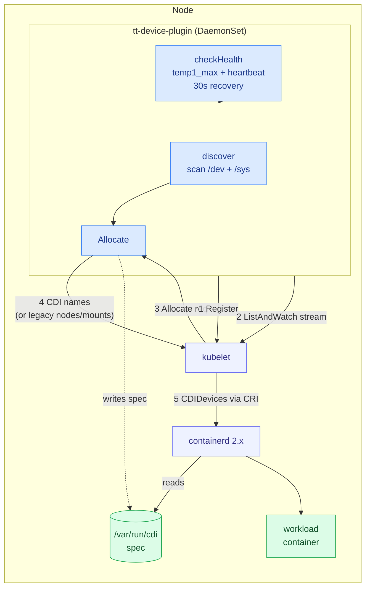
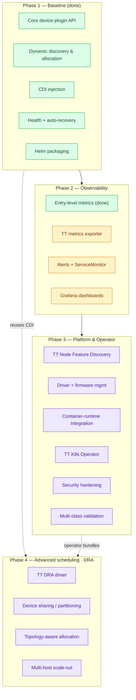
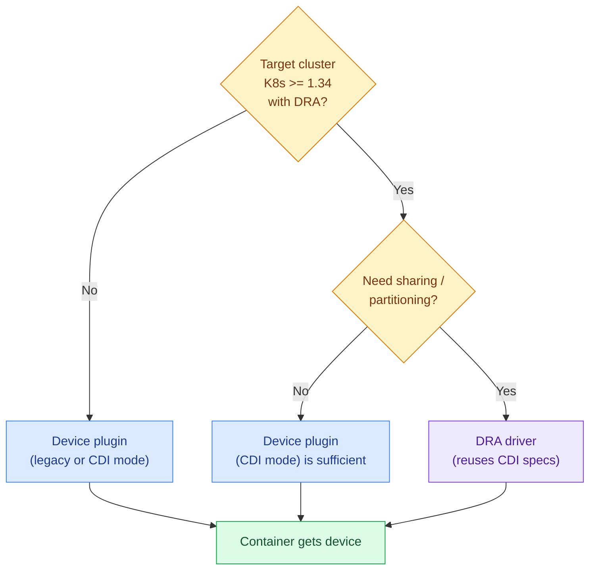

# Roadmap

Direction for the Tenstorrent Kubernetes device plugin. Grounded in how the
established vendor plugins (NVIDIA, AMD, Intel) actually work and in the
Kubernetes ecosystem's shift toward Dynamic Resource Allocation (DRA).

> One-page visual summary: [`docs/roadmap.html`](docs/roadmap.html) — open in a browser.

## Guiding principle

Keep the **device plugin** as the stable, widely-compatible baseline; treat
**CDI** as the injection substrate that bridges to the future; and put advanced
/ sharing features on a **DRA** track rather than bolting them onto the
device-plugin API that DRA supersedes.

---

## Where we are today

**Done and at/above vendor parity:**

- Core API: registration, `ListAndWatch`, `Allocate`, `GetDevicePluginOptions`, stubs for `GetPreferredAllocation` / `PreStartContainer`.
- Health with **auto-recovery** (temp threshold + ARC heartbeat, re-evaluated every 30s) — better than NVIDIA's documented non-recovery on XID.
- **CDI** device injection (opt-in), validated end-to-end on containerd 2.x.
- **Entry-level Prometheus `/metrics`** — per-device health/temperature + per-class device/allocation counters, validated live on n150.
- Multiple resource classes discovered by card type (n150/n300/blackhole/grayskull).
- **Non-privileged** security context (drop ALL caps, read-only rootfs) — initial hardening.
- Helm chart, `dev-deploy.sh` dev loop, hardware verifier.

---

## The strategic context: DRA is GA

Dynamic Resource Allocation (DRA) reached **GA in Kubernetes v1.34** (enabled by
default) and is the structured-parameter successor to the count-based device
plugin model. Device plugins are **not deprecated** — both coexist — but the
ecosystem is steering toward DRA, and NVIDIA and AMD already ship DRA drivers.
Critically, **DRA uses CDI as its injection mechanism**, so the CDI work already
done is the bridge, not throwaway.

This reshapes the roadmap: features that DRA does better (device sharing /
partitioning) should be built on a DRA driver, **not** as device-plugin-era
time-slicing.

---

## Phased plan

Scope was cross-checked against the **NVIDIA GPU Operator**, **AMD ROCm** and
**Intel device-plugin** stacks so nothing an established vendor ships is missed;
items marked ⭐ are additions surfaced by that cross-check.

### Phase 1 — Device plugin baseline ✅ done

| Feature | Status | Rationale |
|---------|:------:|-----------|
| Core device-plugin API | ✅ | Registration, `ListAndWatch`, `Allocate`, options + stubs. |
| Dynamic discovery & allocation | ✅ | Scans `/dev` + sysfs, serves devices to kubelet, injects on `Allocate`. |
| CDI injection (opt-in) | ✅ | Validated end-to-end on containerd 2.x; the bridge to DRA. |
| Health with auto-recovery | ✅ | Temp threshold + ARC heartbeat, 30s re-eval. Beyond NVIDIA parity. |
| Helm packaging | ✅ | Chart for DaemonSet deploy. |

### Phase 2 — Observability

| Feature | Priority | Rationale |
|---------|:--------:|-----------|
| **Entry-level metrics export** | ✅ done | Per-device health/temperature + per-class device/allocation counters over `/metrics`, validated live on n150. |
| **TT metrics exporter** | 🔥 High | DCGM-style telemetry (power, voltage, current, clocks, PCIe errors). Verified present in n150 sysfs. Splits deep telemetry out of the plugin, mirroring DCGM-exporter / device-metrics-exporter. |
| **Alerts + ServiceMonitor** ⭐ | Medium | `PrometheusRule` + `ServiceMonitor` so failures page, not just graph. |
| **Grafana dashboards** | Medium | Fleet health / temperature / utilization panels over the exporter. |

### Phase 3 — Platform & operator

| Feature | Priority | Rationale |
|---------|:--------:|-----------|
| **TT Node Feature Discovery** | Medium | Label nodes with card type / firmware / count / topology so schedulers target hardware. NVIDIA-style GFD over NFD. |
| **Driver + firmware management** ⭐ | Medium | Operator-managed `tt-kmd` install/upgrade and `tt-flash` firmware, like NVIDIA/AMD driver containers. |
| **Container-runtime integration** | Medium | Managed CDI enablement for containerd / CRI-O (the `nvidia-container-toolkit` equivalent). |
| **TT K8s Operator** | Medium | Owns install/upgrade/config of plugin + NFD + exporter + driver (+ later DRA). |
| **Security hardening** ⭐ | Medium | Complete the non-privileged posture: least-privilege RBAC, seccomp, image scanning, full review. Only initial hardening exists today. |
| **Multi-class validation & conformance** ⭐ | Medium | Validate discovery/health/allocation across n300 / Blackhole / Grayskull; fix resource-class granularity (split Blackhole into p100/p150/p300). |

### Phase 4 — Advanced scheduling · DRA

| Feature | Priority | Rationale |
|---------|:--------:|-----------|
| **TT DRA driver** | Medium | The strategic bet. Reuses existing CDI specs. Gate on the minimum K8s version TT must support (DRA needs ≥1.34). `DRAExtendedResource` (KEP-5004) lets a DRA driver still serve classic `tenstorrent.com/n150: 1` requests. |
| **Device sharing / partitioning** | Medium | Do this **via DRA**, not device-plugin time-slicing. Gated on a hardware question: does TT silicon support partitioning (MIG-like) or tolerate oversubscription? |
| **Topology-aware allocation** ⭐ | Medium | `GetPreferredAllocation` / NUMA + multi-ASIC locality (n300 = 2 chips, T3K = 8, Galaxy = 32). Needed the moment we leave single-n150. |
| **Multi-host scale-out topology** ⭐ | Low | TT's distinctive axis: cards mesh over **Ethernet**. Topology-aware placement of multi-chip jobs, akin to NVIDIA's NVLink/network awareness. |

---

## Explicitly out of scope (skip)

| Item | Why skip |
|------|----------|
| Runtime hot-plug detection | **No major vendor does it.** Startup discovery + kubelet-restart re-discovery is the norm. Add only if a real add/remove-live requirement appears. |
| Device-plugin time-slicing / MPS | Superseded by DRA. Building it now is throwaway work. |
| `GetPreferredAllocation` (NUMA) now | Single card reports NUMA `-1`; nothing to optimize today. Deferred to Phase 4 for multi-ASIC / multi-host. |

---

## Decision: device plugin vs DRA for a given cluster

**Rule of thumb:** the device plugin is the compatibility floor and stays the
primary path for now. Reach for a DRA driver when (a) your supported clusters are
on ≥1.34 and (b) you need capabilities the device plugin API cannot express —
chiefly flexible sharing/partitioning.

---

## At a glance vs the vendors

| Capability | NVIDIA | AMD | Intel | TT (now) | TT (planned) |
|------------|:------:|:---:|:-----:|:--------:|:------------:|
| Core device-plugin API | ✅ | ✅ | ✅ | ✅ | ✅ |
| Health w/ auto-recovery | ❌ | 🟡 | 🟡 | ✅ | ✅ |
| CDI injection | ✅ | ❌ | ✅ | ✅ | ✅ |
| Non-privileged / hardened | 🟡 | ❌ | 🟡 | 🟡 | ✅ |
| Prometheus `/metrics` | ✅ | ✅ | 🟡 | ✅ | ✅ |
| Metrics exporter (telemetry) | ✅ | ✅ | 🟡 | 🟡 | ✅ P2 |
| Grafana dashboards | ✅ | ✅ | 🟡 | ❌ | ✅ P2 |
| Alerts / ServiceMonitor | ✅ | ✅ | 🟡 | ❌ | ✅ P2 |
| NFD / node labeling | ✅ | ✅ | ✅ | ❌ | ✅ P3 |
| Driver + firmware mgmt | ✅ | ✅ | 🟡 | ❌ | ✅ P3 |
| Container-runtime integration | ✅ | ✅ | ✅ | 🟡 | ✅ P3 |
| Operator (lifecycle) | ✅ | 🟡 | ✅ | ❌ | ✅ P3 |
| Stack validator | ✅ | 🟡 | 🟡 | ❌ | ✅ P3 |
| DRA driver | ✅ | ✅ | 🟡 | ❌ | ✅ P4 |
| Device sharing / partitioning | ✅ | 🟡 | 🟡 | ❌ | ✅ P4 (DRA) |
| Topology-aware allocation | ✅ | 🟡 | ✅ | ❌ | ✅ P4 |
| Multi-host scale-out topology | ✅ | 🟡 | 🟡 | ❌ | ✅ P4 |

Legend: ✅ full · 🟡 partial/experimental · ❌ none · P1–P4 = target phase.
