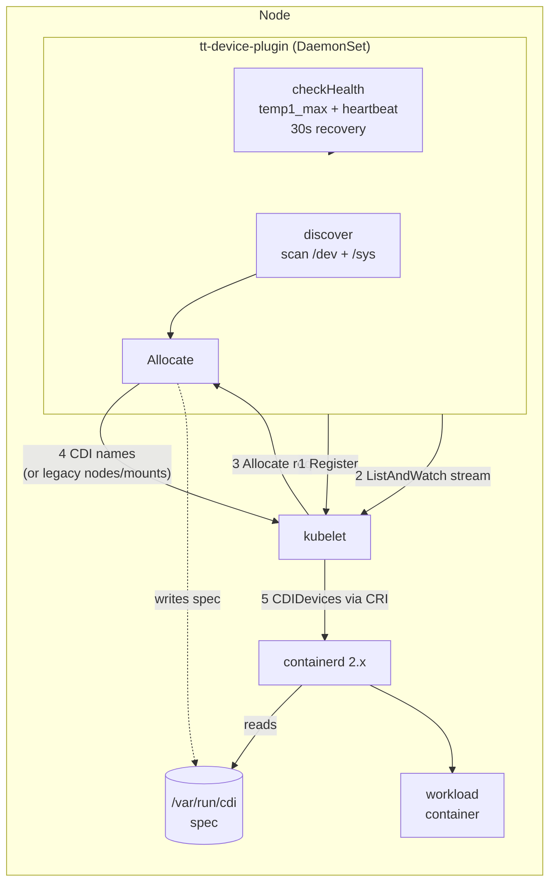
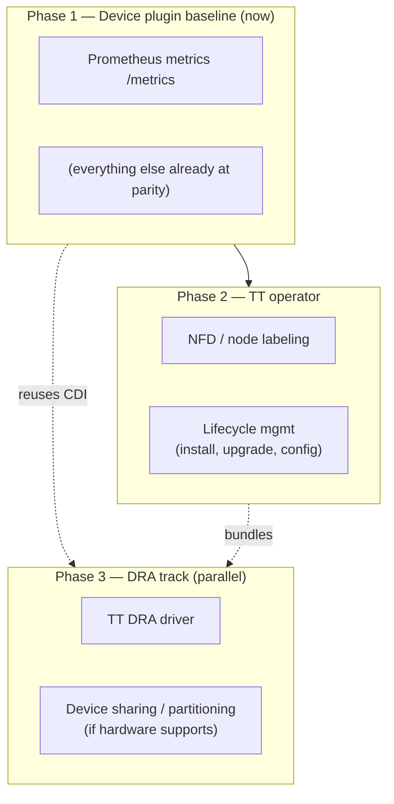
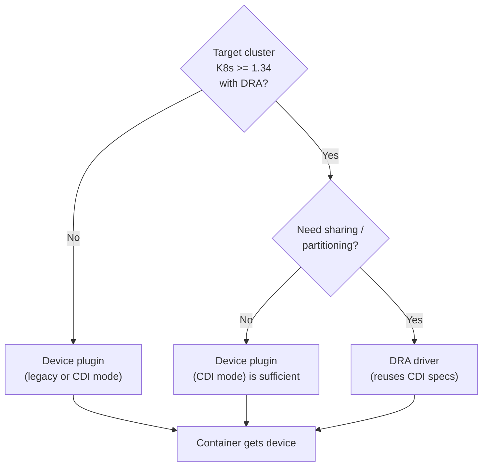

# Roadmap

Direction for the Tenstorrent Kubernetes device plugin. Grounded in how the
established vendor plugins (NVIDIA, AMD, Intel) actually work and in the
Kubernetes ecosystem's shift toward Dynamic Resource Allocation (DRA).

## Guiding principle

Keep the **device plugin** as the stable, widely-compatible baseline; treat
**CDI** as the injection substrate that bridges to the future; and put advanced
/ sharing features on a **DRA** track rather than bolting them onto the
device-plugin API that DRA supersedes.

---

## Where we are today

**Done and at/above vendor parity:**

- Core API: registration, `ListAndWatch`, `Allocate`, `GetDevicePluginOptions`, stubs for `GetPreferredAllocation` / `PreStartContainer`.
- Health with **auto-recovery** (temp threshold + ARC heartbeat, re-evaluated every 30s) — better than NVIDIA's documented non-recovery on XID.
- **CDI** device injection (opt-in), validated end-to-end on containerd 2.x.
- Topology/NUMA hints, multiple resource classes (n150/n300/blackhole/grayskull).
- Hardened, **non-privileged** security context (drop ALL caps, read-only rootfs).
- Helm chart, `dev-deploy.sh` CI-mirroring dev loop, hardware verifier.

---

## The strategic context: DRA is GA

Dynamic Resource Allocation (DRA) reached **GA in Kubernetes v1.34** (enabled by
default) and is the structured-parameter successor to the count-based device
plugin model. Device plugins are **not deprecated** — both coexist — but the
ecosystem is steering toward DRA, and NVIDIA and AMD already ship DRA drivers.
Critically, **DRA uses CDI as its injection mechanism**, so the CDI work already
done is the bridge, not throwaway.

This reshapes the roadmap: features that DRA does better (device sharing /
partitioning) should be built on a DRA driver, **not** as device-plugin-era
time-slicing.

---

## Phased plan

### Phase 1 — Device plugin baseline (now)

| Feature | Priority | Rationale |
|---------|:--------:|-----------|
| **Prometheus metrics** endpoint | 🔥 High | The only non-scale-gated gap every vendor fills. Export per-device temp/health/heartbeat so failures are visible without `kubectl logs`. Contained: a `/metrics` server over what `checkHealth` already reads. |
| Richer health signals (ECC / PCIe errors) | Low | Opportunistic — add if TT sysfs exposes error counters worth watching. |

### Phase 2 — TT operator

| Feature | Priority | Rationale |
|---------|:--------:|-----------|
| **NFD / node labeling** | Medium | Label nodes with card type / firmware / count so schedulers can target hardware. Bundle NFD in the operator (NVIDIA-style). Only matters with heterogeneous nodes. |
| Lifecycle management | Medium | Operator owns install/upgrade/config of the plugin + NFD + (later) DRA driver. |

### Phase 3 — DRA track (parallel to the operator)

| Feature | Priority | Rationale |
|---------|:--------:|-----------|
| **TT DRA driver** | Medium | The strategic bet. Reuses existing CDI specs. Gate adoption on the minimum K8s version TT must support (DRA needs ≥1.34). `DRAExtendedResource` (KEP-5004) lets a DRA driver still serve classic `tenstorrent.com/n150: 1` requests. |
| **Device sharing / partitioning** | Medium | Do this **via DRA**, not device-plugin time-slicing. Gated on a hardware question: does TT silicon support partitioning (MIG-like) or tolerate oversubscription? |

---

## Explicitly out of scope (skip)

| Item | Why skip |
|------|----------|
| Runtime hot-plug detection | **No major vendor does it.** Startup discovery + kubelet-restart re-discovery is the norm. Add only if a real add/remove-live requirement appears. |
| Device-plugin time-slicing / MPS | Superseded by DRA. Building it now is throwaway work. |
| `GetPreferredAllocation` (NUMA) | Single card reports NUMA `-1`; nothing to optimize. Revisit only for multi-card nodes. |

---

## Decision: device plugin vs DRA for a given cluster

**Rule of thumb:** the device plugin is the compatibility floor and stays the
primary path for now. Reach for a DRA driver when (a) your supported clusters are
on ≥1.34 and (b) you need capabilities the device plugin API cannot express —
chiefly flexible sharing/partitioning.

---

## At a glance vs the vendors

| Capability | NVIDIA | AMD | Intel | TT (now) | TT (planned) |
|------------|:------:|:---:|:-----:|:--------:|:------------:|
| Core API | ✅ | ✅ | ✅ | ✅ | ✅ |
| Health w/ recovery | ❌ | 🟡 | 🟡 | ✅ | ✅ |
| CDI | ✅ | ❌ | ✅ | ✅ | ✅ |
| Non-privileged | 🟡 | ❌ | 🟡 | ✅ | ✅ |
| Prometheus metrics | ✅ | ✅ | 🟡 | ❌ | ✅ P1 |
| NFD / labeling | ✅ | ✅ | ✅ | ❌ | ✅ P2 |
| Operator | ✅ | 🟡 | ✅ | ❌ | ✅ P2 |
| Device sharing | ✅ | 🟡 | 🟡 | ❌ | ✅ P3 (DRA) |
| DRA driver | ✅ | ✅ | 🟡 | ❌ | ✅ P3 |

Legend: ✅ full · 🟡 partial/experimental · ❌ none · P1/P2/P3 = target phase.
